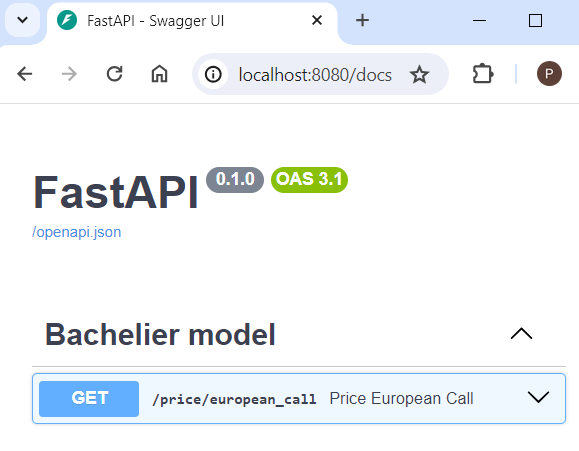

### PythonWorkshops: Setup Validation Instructions

Please follow these steps to validate the setup of your laptop with the necessary software.
Troubleshooting of common problems is listed below the instructions.
#### Validation Steps

1. **Verify Python Installation**
   - Open your command prompt or terminal.
   - Type the following command and press Enter:
     ```sh
     python --version
     ```
   - You should see a version number (e.g., Python 3.9.1). Ensure it is version 3.9 or higher.

2. **Verify Poetry Installation**
   - In your command prompt or terminal, type:
     ```sh
     poetry --version
     ```
   - You should see the output `Poetry version 1.5.0`.

3. **Test a Python Script in Visual Studio Code**
   - Open Visual Studio Code.
   - Create a new file and save it with a `.py` extension (e.g., `workfile.py`).
   - Copy and paste the following simple script into the file:
     ```python
     print("Hello world!")
     ```
   - Save the file.
   - Ensure that the file is saved in the `PythonWorkshops` directory.
   - Open the integrated terminal in Visual Studio Code (View > Terminal) and navigate to the `PythonWorkshops` directory if you are not already there:
     ```sh
     cd path/to/your/project/PythonWorkshops
     ```
   - Run the script by typing:
     ```sh
     python workfile.py
     ```
   - You should see the output `Hello world!`.

4. **Validate Poetry Project Setup**
   - Open your command prompt or terminal.
   - Navigate to the `PythonWorkshops` directory:
     ```sh
     cd path/to/your/project/PythonWorkshops
     ```
   - Run the following command to install the project dependencies using Poetry:
     ```sh
     poetry install
     ```
   - When running this command for the first time, you should see packages installing, which will look something like (details may differ):
        ```sh
       Installing dependencies from lock file
       
       Package operations: 22 installs, 0 updates, 0 removals
        - Installing package1 (1.0.0)
        - Installing package2 (2.1.0)
        ...
        - Installing packageN (N.N.N)
        ```
   - After the dependencies are installed, you should see a `.venv` directory created under `PythonWorkshops`. This is a virtual environment, containing all installed libraries. 

4. **Validate Dependencies installed by Poetry**
   - This validation step requires that the `poetry install` worked correctly in previous step 
   - Open your command prompt or terminal.
   - Navigate to the `PythonWorkshops` directory:
     ```sh
     cd path/to/your/project/PythonWorkshops
     ```
   - Run the following command to check black's version and pytest version:
     ```sh
     poetry run black --version
     poetry run pytest --version
     ```
   - Both commands should return the version of the software, e.g.
     ```sh
     black, a.b.c
     pytest x.y.z
     ```
   - Run the project script to ensure the `pypricer` API is working:
     ```sh
     poetry run python pypricer/pypricer_api.py
     ```
   - You should see output similar to the following, indicating that the `pypricer_api.py` script is running correctly (details may differ):
     ```
     INFO:     Uvicorn running on http://localhost:8080 (Press CTRL+C to quit)
     INFO:     Started reloader process [28764] using statreload
     INFO:     Started server process [28766]
     INFO:     Waiting for application startup.
     INFO:     Application startup complete.
     ```
   - Open your web browser, navigate to the URL given by the code and add `/docs` to it (here: `http://localhost:8080/docs`). You should see the FastAPI auto-generated documentation for your API.
   

#### Troubleshooting Common Issues

If you encounter issues where Python or Poetry is not recognized as a command, it is likely that they are not added to your system's PATH. Here’s how to fix this:

1. **Adding Python to PATH**
   Additional resource: [realpython.com](https://realpython.com/add-python-to-path/)
   - **Windows:**
     - Open the Start Search, type in "env", and select "Edit the system environment variables" (pl. "Zmienne środowiskowe").
     - In the System Properties window, click on the "Environment Variables" button.
     - In the Environment Variables window, find the "PATH" variable in the "System variables" section, and click "Edit".
     - Click "New" and add the path to your Python installation (e.g., `C:\Users\YourUsername\AppData\Local\Programs\Python\Python39`).
     - Click "OK" to close all windows.
     - Close and reopen VSCode, and/or command lines/terminals to allow them to apply the change to PATH

2. **Adding Poetry to PATH**
   - **Windows:**
     - Poetry’s installer typically adds Poetry to the PATH, but if it doesn’t, follow the steps for adding Python to PATH and add the path to the Poetry binary (e.g., `C:\Users\YourUsername\AppData\Local\Programs\Python\Python39\Scripts`).

3. **Poetry saying the Python version is incompatible**
   See requirement for Python >= 3.9, and step 1 for validation. Note that Poetry creates a virtual environment, and by running commands as:
   ```bash
   poetry run <some command>
   ```
   you are executing it using the virtual environment, which may contain different versions of programs from the standard
   ```bash
   <some command>
   ```
   Running `poetry install` should ensure however, that you have the right python and python packages versions ready to use in your virtual environment.
